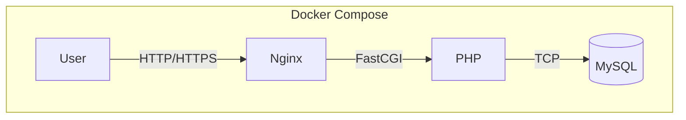
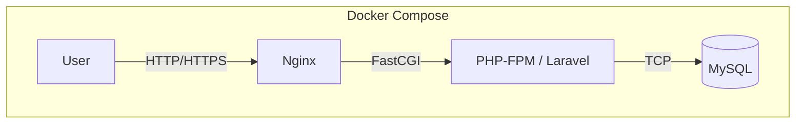
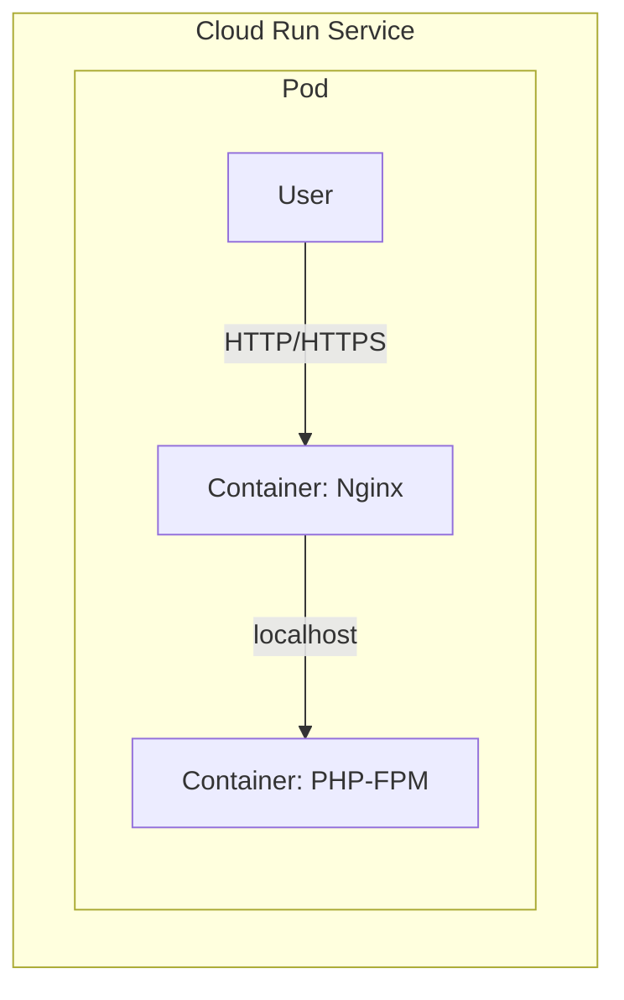
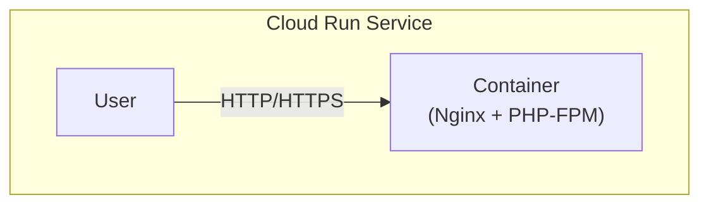

# PHP Examples for Google Cloud

このリポジトリは、Google Cloud で PHP アプリケーションを動かすための、様々な構成パターンをまとめたハンズオン集です。

## ハンズオンコンテンツ

### [01-php-mysql-demo](./01-php-mysql-demo/)

基本的な `PHP-FPM` + `Nginx` + `MySQL` の3層構成です。`docker-compose` を使ってローカル環境を構築します。

### [02-laravel-mysql-demo](./02-laravel-mysql-demo/)

`01-php-mysql-demo` と同じ3層構成ですが、PHPフレームワークとして `Laravel` を使用した例です。

### [03-php-nginx-sidecar-demo](./03-php-nginx-sidecar-demo/)

Cloud Run の **サイドカー（マルチコンテナ）機能** を使った構成です。1つの Cloud Run サービスの中で、`Nginx` コンテナと `PHP-FPM` コンテナを同時に動かします。

### [04-php-buildpacks-demo](./04-php-buildpacks-demo/)

`Dockerfile` を使わず、Google Cloud Buildpacks によって単一のコンテナイメージをビルドする構成です。コンテナの中には `Nginx` と `PHP-FPM` が両方含まれています。

